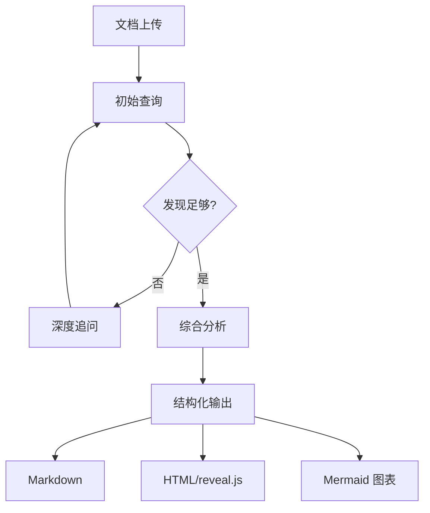
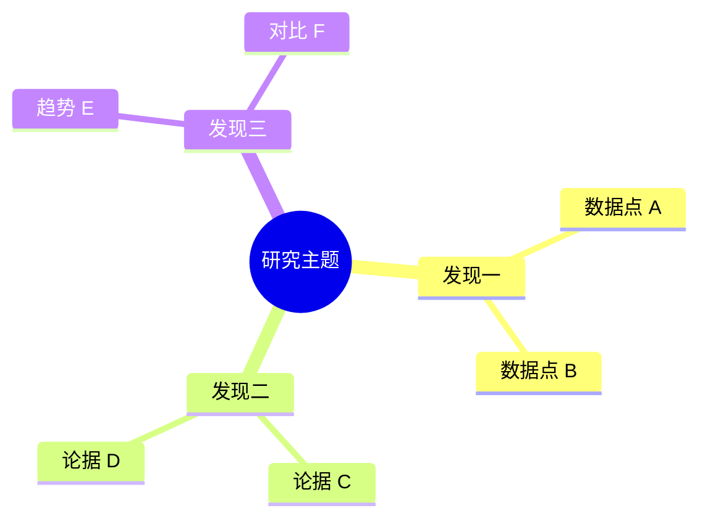
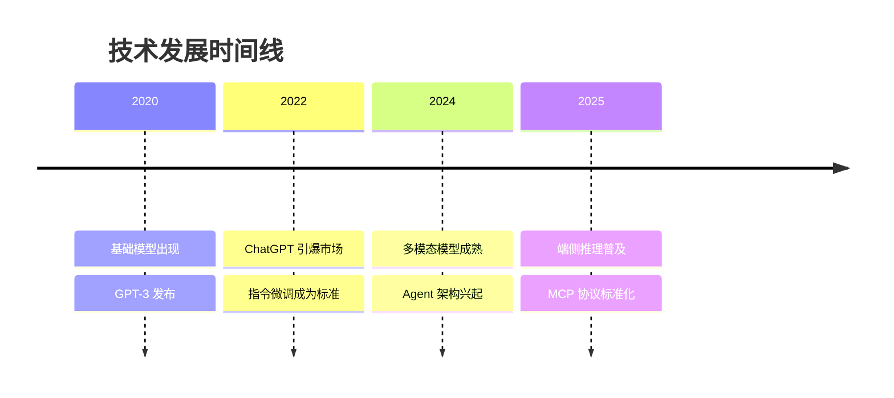
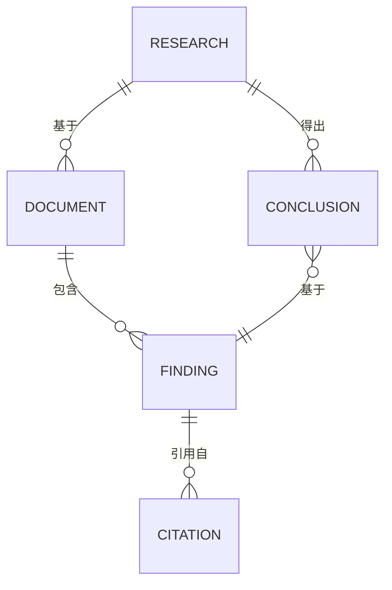

# NotebookLM 研究技能

利用 NotebookLM 的深度研究能力，从上传文档中提取知识、生成引用驱动的答案，并将研究成果转化为高质量的信息图风格演示文稿和结构化输出。

---

## 核心能力

1. **深度研究** — 基于上传文档进行多轮深度问答，生成引用溯源的答案
2. **信息图生成** — 将研究发现转化为视觉层次清晰的信息图演示
3. **引用追溯** — 每个结论和数据点都链接到原始文档来源
4. **多格式输出** — 支持 Markdown、HTML/reveal.js、Mermaid 图表等格式
5. **综合分析** — 跨文档交叉分析，识别共性、差异和趋势

---

## 研究工作流

### 完整流程

```
上传文档 → 初始查询 → 深度追问 → 综合分析 → 结构化输出 → 演示呈现
   │          │          │          │          │          │
   ▼          ▼          ▼          ▼          ▼          ▼
 来源准备   问题设计   迭代探索   交叉对比   格式选择   视觉设计
```

### 阶段一：文档上传与准备

#### 支持的文档类型

| 类型 | 格式 | 最佳实践 |
|------|------|---------|
| PDF | 学术论文、报告 | 确保文字可选（非扫描图片） |
| 网页 | URL 链接 | 选择内容完整的页面 |
| 文本 | TXT、Markdown | 结构清晰的纯文本 |
| Google Docs | 在线文档 | 确保共享权限 |
| Google Slides | 演示文稿 | 含备注的幻灯片更佳 |
| YouTube | 视频链接 | 需有字幕/转录 |
| 音频 | MP3、WAV | 需有转录文本 |

#### 文档准备清单

1. **筛选相关文档** — 只上传与研究问题直接相关的文档
2. **检查文档质量** — 确保文字清晰、结构完整
3. **控制数量** — 单个 Notebook 建议 5-50 个来源
4. **标注来源** — 记录每个文档的元数据（作者、日期、来源）
5. **预分类** — 按主题对文档分组

#### 来源管理模板

```markdown
## 研究来源清单

| # | 文档标题 | 类型 | 作者/来源 | 日期 | 关键主题 |
|---|---------|------|----------|------|---------|
| 1 |  | PDF/URL/... |  |  |  |
| 2 |  |  |  |  |  |
| 3 |  |  |  |  |  |

### 来源分组
- **组 A: [主题]** — 来源 #1, #3, #5
- **组 B: [主题]** — 来源 #2, #4
```

### 阶段二：查询与深度研究

#### 查询设计原则

**有效的查询应该：**
- 具体且有明确的范围边界
- 能通过上传文档回答
- 能产生可引用的结论

**查询类型与示例：**

| 查询类型 | 描述 | 示例 |
|---------|------|------|
| **事实查询** | 提取特定数据点 | "文档中提到的年均增长率是多少？" |
| **比较查询** | 跨文档对比 | "论文 A 和论文 B 在方法论上有何区别？" |
| **综合查询** | 多来源综合分析 | "综合所有来源，影响用户留存的前三大因素是什么？" |
| **因果查询** | 探索因果关系 | "根据报告，什么因素导致了市场份额下降？" |
| **趋势查询** | 识别时间变化 | "从 2020 到 2025 年，该领域的研究重点如何变化？" |
| **矛盾查询** | 发现分歧 | "不同来源对该技术的效果评估有何矛盾？" |

#### 迭代深度追问策略

```
第一轮：广泛探索
  "关于 [主题]，这些文档中的核心发现是什么？"
       │
       ▼
第二轮：聚焦细节
  "详细解释 [具体发现]，引用具体数据和来源。"
       │
       ▼
第三轮：交叉验证
  "其他文档是否支持或反驳 [这个结论]？"
       │
       ▼
第四轮：综合提炼
  "综合所有发现，提出 3 个关键结论和依据。"
```

### 阶段三：综合分析

#### 分析框架

**MECE 分析法（Mutually Exclusive, Collectively Exhaustive）：**

```markdown
## 研究主题: [主题名称]

### 维度 1: [分类名称]
- 发现 1.1 [来源: Doc A, p.12]
- 发现 1.2 [来源: Doc B, §3]

### 维度 2: [分类名称]
- 发现 2.1 [来源: Doc C, Fig.3]
- 发现 2.2 [来源: Doc A, p.45]

### 交叉发现
- 来源 A 和 C 在 [方面] 一致
- 来源 B 与 A 在 [方面] 存在矛盾

### 信息空白
- 关于 [方面] 缺乏数据
- [方面] 需要更多来源验证
```

#### 引用与溯源规范

所有研究输出必须包含引用，格式遵循以下标准：

**行内引用：**
```markdown
用户留存率在第 30 天平均为 23.5%[^1]，显著低于行业基准 35%[^2]。

[^1]: 《2025 移动应用留存报告》, App Annie, p.18
[^2]: 《SaaS Metrics Benchmark》, OpenView Partners, Table 3.2
```

**引用块：**
```markdown
> "深度学习在小样本场景下的泛化能力仍然有限，需要结合领域知识进行模型设计。"
> — Zhang et al., 2024, "Few-Shot Learning: A Survey", §4.3
```

**引用汇总表：**
```markdown
| 引用 # | 来源 | 位置 | 相关发现 |
|--------|------|------|---------|
| [^1] | App Annie 报告 | p.18 | 留存率数据 |
| [^2] | OpenView 基准 | Table 3.2 | 行业基准对比 |
```

### 阶段四：结构化输出

#### 输出格式选择指南

| 格式 | 适用场景 | 优势 |
|------|---------|------|
| **Markdown** | 文档、Wiki、笔记 | 通用性强、版本控制友好 |
| **HTML/reveal.js** | 演示、分享 | 视觉丰富、交互式 |
| **Mermaid 图表** | 流程、关系、架构 | 纯文本生成、易维护 |
| **信息图 Markdown** | 一页式总结 | 信息密度高、易扫读 |

---

## 信息图设计规范

### 视觉层次体系

信息图的核心是建立清晰的视觉层次（Visual Hierarchy），引导读者的视线流动。

#### 层次结构

```
Level 0: 主标题 — 一句话概括全文核心
   ↓
Level 1: 核心数据/结论 — 最大字号、最醒目颜色、居中布局
   ↓
Level 2: 分类/维度标题 — 中等字号、分区色块
   ↓
Level 3: 具体发现/数据点 — 标准字号、图标辅助
   ↓
Level 4: 来源引用/注释 — 小字号、浅色调
```

#### 色彩系统

```markdown
### 推荐配色方案

**方案 A: 专业蓝（商业/技术报告）**
- 主色: #2563EB (蓝色)
- 强调: #F59E0B (琥珀)
- 成功: #10B981 (绿色)
- 警告: #EF4444 (红色)
- 背景: #F8FAFC
- 文字: #1E293B

**方案 B: 学术绿（研究/学术报告）**
- 主色: #059669 (绿色)
- 强调: #7C3AED (紫色)
- 辅助: #0891B2 (青色)
- 背景: #F0FDF4
- 文字: #1A2E05

**方案 C: 暗色主题（技术/数据报告）**
- 主色: #60A5FA (亮蓝)
- 强调: #FBBF24 (金色)
- 成功: #34D399 (亮绿)
- 背景: #0F172A
- 文字: #E2E8F0
```

#### 排版规格

```markdown
### 字号规格（rem 基准）

| 元素 | 字号 | 行高 | 字重 |
|------|------|------|------|
| 主标题 | 2.5rem (40px) | 1.2 | 800 |
| 核心数据 | 3.5rem (56px) | 1.0 | 900 |
| 分区标题 | 1.5rem (24px) | 1.3 | 700 |
| 正文 | 1rem (16px) | 1.6 | 400 |
| 引用/注释 | 0.75rem (12px) | 1.4 | 300 |

### 间距系统

| 层级 | 间距 |
|------|------|
| 主区块间距 | 48px |
| 子区块间距 | 24px |
| 元素内间距 | 16px |
| 紧凑间距 | 8px |
```

### 信息图布局模式

#### 模式一：数据驱动摘要

```markdown
┌──────────────────────────────────────────┐
│         📊 [研究主题]                     │
│     一句话核心发现                         │
├──────────────────────────────────────────┤
│  ┌──────┐  ┌──────┐  ┌──────┐           │
│  │ 3.5x │  │ 78%  │  │ #1   │           │
│  │增长率 │  │采纳率 │  │市场份额│          │
│  └──────┘  └──────┘  └──────┘           │
├──────────────────────────────────────────┤
│  发现 1          │  发现 2                │
│  详细说明...     │  详细说明...           │
│  [来源 A, B]     │  [来源 C]             │
├──────────────────────────────────────────┤
│  📈 趋势图 / 时间线                       │
├──────────────────────────────────────────┤
│  结论 & 建议                              │
│  来源列表                                 │
└──────────────────────────────────────────┘
```

#### 模式二：对比分析

```markdown
┌──────────────────────────────────────────┐
│         ⚖️ [对比主题]                     │
├───────────────────┬──────────────────────┤
│    选项 A          │    选项 B            │
├───────────────────┼──────────────────────┤
│  维度 1: ✅ 优     │  维度 1: ⚠️ 中       │
│  维度 2: ⚠️ 中     │  维度 2: ✅ 优       │
│  维度 3: ❌ 弱     │  维度 3: ✅ 优       │
├───────────────────┴──────────────────────┤
│  综合评估与推荐                            │
│  引用来源                                 │
└──────────────────────────────────────────┘
```

#### 模式三：流程/时间线

```markdown
┌──────────────────────────────────────────┐
│         🔄 [流程/历程主题]                 │
├──────────────────────────────────────────┤
│  ①──────→②──────→③──────→④              │
│  阶段一    阶段二    阶段三    阶段四       │
│  说明      说明      说明      说明        │
│  [来源]    [来源]    [来源]    [来源]      │
├──────────────────────────────────────────┤
│  关键转折点与洞察                          │
│  引用来源                                 │
└──────────────────────────────────────────┘
```

---

## 输出格式详细规范

### Markdown 输出

适用于知识库、文档系统、Git 仓库。

```markdown
# 研究报告: [主题]

> **核心发现**: 一句话总结

## 执行摘要
简要概述研究背景、方法和核心结论。

## 关键发现

### 发现 1: [标题]
详细描述，包含数据支撑。
> 引用: [来源, 位置]

### 发现 2: [标题]
详细描述。
> 引用: [来源, 位置]

## 数据分析

| 指标 | 数值 | 来源 | 趋势 |
|------|------|------|------|
|  |  |  | ↑/↓/→ |

## 结论与建议
1. 建议一
2. 建议二

## 参考来源
1. [来源 1 完整信息]
2. [来源 2 完整信息]
```

### HTML/reveal.js 幻灯片输出

适用于演示、分享、汇报。

```html
<!DOCTYPE html>
<html>
<head>
  <meta charset="utf-8">
  <title>研究报告: [主题]</title>
  <link rel="stylesheet" href="https://cdn.jsdelivr.net/npm/reveal.js@5/dist/reveal.css">
  <link rel="stylesheet" href="https://cdn.jsdelivr.net/npm/reveal.js@5/dist/theme/white.css">
  <style>
    :root {
      --primary: #2563EB;
      --accent: #F59E0B;
      --text: #1E293B;
      --bg: #F8FAFC;
    }
    .reveal h1 { color: var(--primary); font-size: 2.5em; }
    .reveal h2 { color: var(--primary); font-size: 1.8em; }
    .stat-number {
      font-size: 3.5em;
      font-weight: 900;
      color: var(--primary);
    }
    .stat-label {
      font-size: 1em;
      color: #64748B;
    }
    .citation {
      font-size: 0.7em;
      color: #94A3B8;
      text-align: right;
    }
    .highlight-box {
      background: var(--bg);
      border-left: 4px solid var(--primary);
      padding: 1em;
      margin: 1em 0;
    }
  </style>
</head>
<body>
  <div class="reveal">
    <div class="slides">

      <!-- 标题页 -->
      <section>
        <h1>研究主题</h1>
        <p>核心发现的一句话总结</p>
        <p class="citation">基于 N 个来源的综合分析 | YYYY-MM-DD</p>
      </section>

      <!-- 核心数据页 -->
      <section>
        <h2>核心发现</h2>
        <div style="display:flex;justify-content:space-around;">
          <div>
            <div class="stat-number">3.5x</div>
            <div class="stat-label">增长率</div>
          </div>
          <div>
            <div class="stat-number">78%</div>
            <div class="stat-label">采纳率</div>
          </div>
        </div>
        <p class="citation">来源: 文档 A, p.12; 文档 B, §3</p>
      </section>

      <!-- 详细发现页 -->
      <section>
        <h2>发现一</h2>
        <div class="highlight-box">
          <p>关键发现的详细描述，包含数据支撑和引用。</p>
        </div>
        <p class="citation">来源: 文档 C, Table 2</p>
      </section>

      <!-- 结论页 -->
      <section>
        <h2>结论与建议</h2>
        <ol>
          <li>建议一</li>
          <li>建议二</li>
          <li>建议三</li>
        </ol>
      </section>

    </div>
  </div>
  <script src="https://cdn.jsdelivr.net/npm/reveal.js@5/dist/reveal.js"></script>
  <script>Reveal.initialize();</script>
</body>
</html>
```

### Mermaid 图表输出

适用于流程、关系、架构的可视化。

**流程图：**
````markdown

````

**思维导图：**
````markdown

````

**时间线：**
````markdown

````

**实体关系图：**
````markdown

````

---

## 研究质量检查清单

### 输出前自检

| 检查项 | 标准 | ✅ |
|--------|------|---|
| **引用覆盖** | 每个核心发现都有引用 | |
| **来源多样** | 不依赖单一来源 | |
| **数据准确** | 数字和引文与原文一致 | |
| **逻辑连贯** | 发现之间逻辑自洽 | |
| **信息空白** | 已标注缺失或不确定的部分 | |
| **视觉层次** | 信息图有清晰的阅读路径 | |
| **可操作性** | 结论包含具体建议 | |
| **格式规范** | 输出格式正确、可渲染 | |

### 研究可信度评估

```markdown
## 可信度评估

### 来源质量
- 学术同行评审: X 篇
- 行业权威报告: X 篇
- 一手数据: X 篇
- 二手分析: X 篇

### 发现一致性
- 多来源支持的发现: X 条
- 单来源发现: X 条
- 来源间矛盾: X 处

### 局限性
- 时间范围: YYYY 至 YYYY
- 地理范围: 
- 样本局限: 
- 方法论局限: 

### 综合可信度: 高 / 中 / 低
```

---

## 注意事项

- **尊重版权** — 引用应遵循合理使用原则，不大段复制原文
- **标注不确定性** — 推测性结论应明确标注为"推测"或"需进一步验证"
- **区分事实与观点** — 文档中的事实和作者观点应有区分标识
- **保持中立** — 呈现多方观点，避免选择性引用
- **检查时效性** — 标注数据的采集时间，提醒读者时效风险
- **注意文档质量** — 上传前确认文档可读，OCR 文档可能有识别错误
- **迭代优化** — 第一轮输出后审查引用准确性，必要时回查原文
- **格式兼容** — reveal.js 幻灯片需确保 CDN 资源可访问
